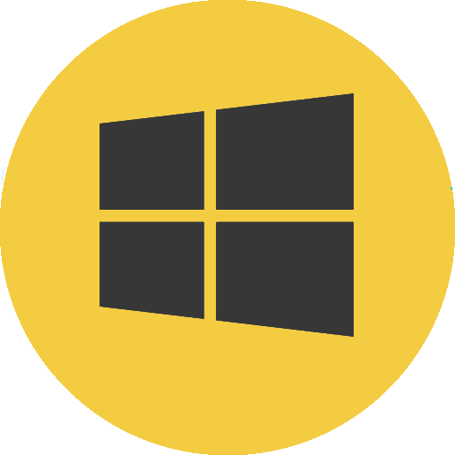
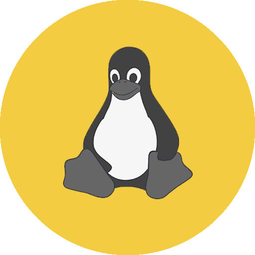

<h1 align="center"> think-laradumps </h1>

<p align="center"> debug tool Using Laradumps App in ThinkPHP6</p>

<p align="center">
  
</p>
<h1 align="center">LaraDumps</h1>
<div align="center">
  <br />
  <p align="center">
    <a href="https://github.com/laradumps/app/releases/download/v1.2.3/LaraDumps-Setup-1.2.3.exe">
      
    </a>
    <a href="https://github.com/laradumps/app/releases/download/v1.2.3/LaraDumps-1.2.3.dmg">
      
    </a>
    <a href="https://github.com/laradumps/app/releases/download/v1.2.3/LaraDumps-1.2.3.AppImage">
      
    </a>
  </p>
  <h3>Click on your OS logo to download the Desktop App.</h3>
  <sub>Available for Windows, Linux and macOS.</sub>
  <br />
  <br />
  <p>
    <a href="https://laradumps.dev"> 📚 Documentation </a>
  </p>
</div>
 <br/>


## 安装

```shell
$ composer require yangweijie/think-laradumps --dev -vvv
```

## 用法

### 👋 Hello Dev,

<br/>

### Get Started

#### Requirements

 PHP 7.2+ and ThinkPHP6.0+

#### Usage

3. 配置 LaraDumps :

编辑 安装扩展后自动创建的 laradumps 配置文件

4. 调试你的代码通过使用 `ds()` 和 ThinkPHP 应用里的 trace 一样使用。

> dsd == halt

5. 运行应用，然后看到调试的信息在 LaraDumps App 窗口里。

Here's an example:

```php
Route::get('/', function () {
    ds('Home page accessed!');
    return view('home');
});
```

```php
ds('')->phpinfo();
```

```php
ds()->table([['id'=1,'name'=>'a']], 'table');
```

```php
ds()->time('event');
ds()->stopTime('event');

```
```php
ds('调试信息1')->s('tab1'); // 可以输出不同调试到不同tab
```

至于显示日志功能，和监听sql，再考虑要不要实现，因为目前这个函数输出的是和ThinkPHP log 独立开来的。
要高度扩展，可以实现基于本库再实现一个log 的驱动，倒时候配置database 的 trace 就行了。

## License

MIT